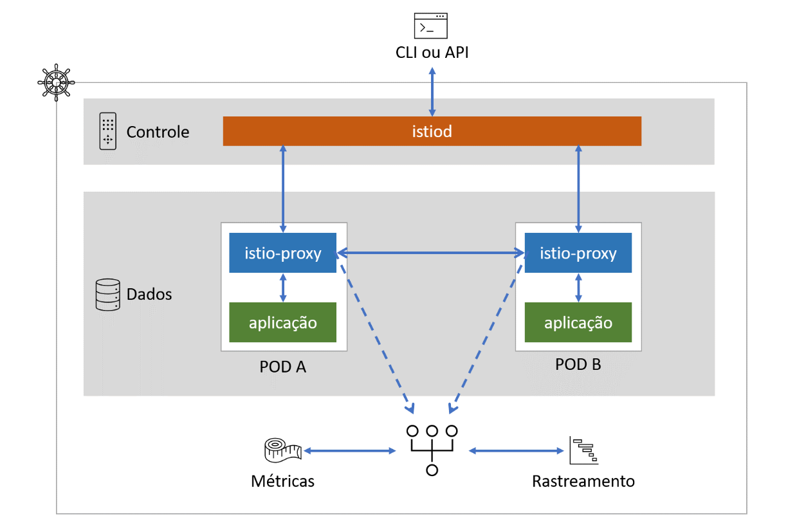
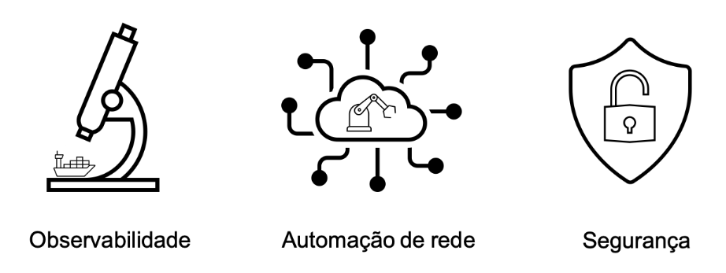

# Bem vindo ao Istio Avançado para Iniciantes

## Sobre este curso

Neste curso você aprenderá os conceitos e práticas, básicas e avançadas de Istio Service Mesh.

Com Istio e Kubernetes, você levará seus desenvolvimentos à outro patamar.

Nossa didática será introduzir os temas de forma simples e rapidamente apresentar casos reais e mais complexos. "Olá Mundo!" será apenas o começo, nosso objetivo será a "Dominiação Mundial!!".

## Requerimentos

* Conhecimentos básicos de Kubernetes
* Equipamento para executar o Minikube ou Docker-Desktop ou acesso a um cluster de kubernetes
* Linux (Qualquer distro atual de Linux, Windows com wsl2 ou MacOS)

## Descrição

⛵ Atualizado para o [Istio 1.9.4](https://istio.io/latest/news/releases/1.9.x/announcing-1.9/change-notes/)!!

[Istio](https://istio.io/) é uma plataforma de malha de serviço de [código aberto](https://pt.wikipedia.org/wiki/C%C3%B3digo_aberto) que fornece maneiras de controlar e monitorar como os serviços se comunicam. Se você desenvolve ou pretende desenvolver arquiteturas orientadas à serviços e utiliza [kubernetes](https://kubernetes.io/), precisa conhecê-lo! Com este curso prático, você ganhará experiência na execução de suas próprias malhas de serviço com Istio.

A malha de serviço é uma camada de infraestrutura dedicada para lidar com a comunicação serviço à serviço a fim de torná-la visível, gerenciável e controlada. A implementação depende da solução, mas no Istio, cada malha de serviço é implementada como uma série de _proxies_.

Com uma malha de serviço, cada endpoint de aplicativo (seja um contêiner, um pod ou um host) é configurado para direcionar o tráfego para um _proxy_ local (instalado como um contêiner secundário, por exemplo). Esse proxy local gerencia coisas como lógica de novas tentativas, mecanismos de criptografia, regras de direcionamento personalizadas, descoberta de serviço, entre outras.

Uma coleção desses proxies forma uma “malha” de serviços que agora compartilham propriedades comuns de gerenciamento de tráfego de rede. Esses _proxies_ podem ser controlados a partir de um plano de controle centralizado onde os operadores podem compor uma política que afeta o comportamento de toda a malha.

Se você não está familiarizado com o [Radar de tecnologia da Thoughworks](https://www.thoughtworks.com/pt/radar), ele é uma lista de tecnologias avaliada por pessoas como [Martin Fowler](https://martinfowler.com/), [Neal Ford](http://nealford.com/) e [Rebecca Parsons](https://www.thoughtworks.com/profiles/rebecca-parsons). Grande parte da industria utiliza o radar para guiar suas decisões no desenvolvimento de software. Nas suas avaliações são recomendadas a adoção, teste ou deixar de usar, linguagens, frameworks, ferramentas e plataformas. O Istio aparece am algumas [edições e em 2020](https://www.thoughtworks.com/pt/radar/platforms/istio) foi recomendada a sua adoção.

Arquitetura do Istio

Você também pode obter uma lista atualizada das empresas que utilizam o Istio e ler sobre alguns dos seus casos de uso em [Istio - Who's using Istio](https://istio.io/latest/about/community/customers/).

## O que o Istio pode fazer por mim?

Istio endereças três áreas para manutenção dos serviços:

Se você tem um crescente número de serviços, escritos em diferentes linguagens, em infraestruturas heterogêneas, o Istio oferece a abstração necessária para simplificar a manutenção desses serviços.

## Sobre o curso

Este curso foi projetado para ser claro, compreensível e divertido! Você aprenderá como usar o Istio em cenários de produção reais e conhecerá como ele funciona na prática.

Você pode executar este curso em seu próprio computador usando o docker-desktop ou minikube (mínimo de 16 Gb de RAM), na próxima seção você encontrará outras alternativas.

Este curso combina teoria com a prática e mostrará como utilizar o Istio para resolver problemas difíceis nos seus projetos.

Você aprenderá em detalhes:

* Gestão de tráfego
* Telemetria
* Visualização da malha de serviços (com Kiali)
* Rastreamento de logs distribuído (com Jaeger)
* Métricas com Grafana
* Como implantar versões canário
* Como fazer "Dark Releases"
* Balanceamento de carga e afinidade de sessão
* Como controlar o tráfego para dentro e fora da malha com Gateways
* Teste de resiliência com injeção de falha
* Interrupção de circuito
* Protegendo o tráfego do cluster com Mutual TLS (mTLS)
* Incluir máquinas virtuais a sua malha de serviços

A curva de aprendizado do Istio é relativamente íngreme - por isso projetamos este curso para ser o mais claro e compreensível possível e espero que com as demonstrações práticas você também se divirta ao longo do caminho. Mas, acima de tudo, o Istio é uma ferramenta extremamente poderosa e também um ótimo complemento para sua caixa de ferramentas e você não precisa usar todas as funcionalidades do Istio de uma vez, pegue o que você precisa, seja entender melhor a malha de serviços através a observabilidade, ou controlar o trafego de dados, ou incrementar as segurança, cada uma dessas funcionalidades podem ser implementadas separadamente e combinadas de acordo com sua necessidade.

Em poucos meses, desde que começamos a desenvolver esse curso, o Istio já recebeu diversas [atualizações](https://istio.io/latest/news/releases/) (1.6.11, 1.6.12, 1.7.4, 1.8.0, 1.8.1) e, enquanto você passa pelas lições, novas atualizações estão a caminho. Esse é um projeto muito ativo, com muitos contribuidores de peso, então fique ligado, sempre que necessário esse curso será atualizado para a versão mais recente.

## Sobre os autores

[Anderson Santos](https://www.linkedin.com/in/adsantos/) - é um engenheiro de software, apaixonado por tecnologia, palestrante e professor, com quase três décadas de experiência em Dev, Ops, DevOps, arquitetura e engenharia de software. Atualmente trabalha em TI para o setor de educação e ministra cursos corporativos sobre Kubernetes e Istio e palestras sobre arquitetura, desenvolvimento e operação de software em larga escala.

Anderson tem experiência em diversos setores da indústria, sendo os últimos dez anos, nos setores de telecomunicações e educação. Desde 1998 auxilia seus clientes na tomada de decisão implantação e operação de processos, arquiteturas e tecnologias para o desenvolvimento e modernização de software para nuvem.

[Leonardo Osse](https://www.linkedin.com/in/leonardo-osse-a4423128/) é desenvolvedor com grande experiência nas nuvem AWS e Azure. Tem trabalhando no auxilio e formação técnica de equipes ágeis no setor de educação.

[Daniel Ribeiro](https://www.linkedin.com/in/daniel-ribeiros/) é engenheiro de DevOps, especialista em Azure, com mais duas décadas de experiência em nuvens e no apoio à equipes de desenvolvimento para otimização do uso de recursos e automação com IaC.

## A quem se destina este curso

Desenvolvedores que desejam aprender o que o Istio pode fazer para seus projetos.

Qualquer pessoa que já tentou entender o Istio, mas teve dificuldades com a documentação.

Arquitetos de Software que estejam projetando sistemas distribuídos (Exemplo: microsserviços)

## Por que é de graça?

Nós trabalhamos em tempo integral para grandes empresas, onde temos a oportunidade e obrigação de escolher, implantar e operar diversas tecnologias.

No curso do nosso trabalho, como todos, fazemos muitos amigos e aprendemos muito com eles. Nossos cursos são um agregado das nossas experiências e troca de conhecimentos com nossos colegas e tem por objetivo exclusivo, retribuir essas oportunidades e fazer novos amigos.

Contribua conosco, de um feedback honesto e nos ajude a tornar esse curso mais útil para você e seus amigos.

:rocket: Então está na hora de começar [Parte 1 - Preparação](01_preparacao.md).