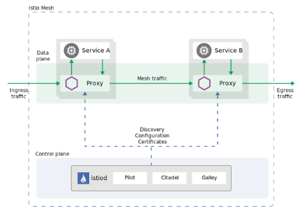

# Arquitetura do Istio

Você já começou a ter uma idéia do que o Istio é capaz e nas próximas seções iremos desvendar mais e mais das suas funcionalidades, porém ainda não discutimos como o Istio funciona, como é  a sua arquitetura.

Antes de discutir a arquitetura do Istio é importante que você saibe que ele não é a única implementação desse tipo, atualmente há diversas implementações, tais como:

* [Consul](https://www.consul.io/) - Desenvolvido pela [Hashicorp](https://www.hashicorp.com/), é uma solução de código aberto de malha de serviço que fornece um plano de controle completo com descoberta de serviço, configuração e funcionalidade de segmentação. Tem uma arquitetura parecida com a do Istio, mas o sidecar não é o Envoy é proprietário.
* [Kuma](https://kuma.io/) - Código-aberto, mantido pela empresa [Kong](https://konghq.com/), com arquitetura semelhante ao Istio, onde o kuma está no plano de controle e o Envoy no plano de dados.
* [Linkerd](https://linkerd.io/) - É código-aberto 100% linça Apache, incubado pema [Cloud Native Computing Fundation](https://www.cncf.io/), a mesma fundação que mantem o kubernetes e o envoy, entre outros projetos. Não utiliza o Envoy, o seu proxy é o linkerd-proxy, mas sua arquitetura é muito semelhante ao do Istio e Kuma.
* [Traefic Mesh](https://traefik.io/traefik-mesh/) - É uma solução de código aberto, não invasiva que permite a visibilidade e o gerenciamento dos fluxos de tráfego dentro de qualquer cluster do Kubernetes. Ele não usa _proxies_ em cada POD, em vez disso rotea o tráfego através de _proxies_ em cada nó do cluster.

Nesta seção discutiremos como o Istio faz sua mágica e o que precisamos fazer com nossas aplicações para tirar proveito de todas as suas funcionalidades.

## O que é uma malha de serviços

Neste ponto você já deve ter uma idéia clara do que é uma malha de serviços (service mesh), provavelmente foi o que o motivou a fazer esse curso, mas porque o Istio é tão importante nesse contexto?

Primeiro precisamos entender o que o Istio oferece:

* Descoberta de serviços
* Observabilidade (metricas)
* Controle de taxa de requisições (Rate Limiting)
* Interrupção de circuito (Circuit Breaking)
* Comutação de tráfego
* Balanceamento de carga
* Autenticação e autorização
* Rastreamento de logs distribuído

Todas essas funcionalidades tem como objetivo entender, monitorar e controlar a relação entre os serviços ou microsserviços.

Uma malha é formada quando um serviço invoca outro serviço, no princípio isso pode se reduzir a uma duzia de serviços interagindo entre eles, mas em pouco tempo isso pode escalar para centenas e consumidores e produtores externos se unirão a malha tornando-a extremamente complexa.

Você já deve ter ouvido falar do cálculo da quantidade de canais de comunicação:

\begin{equation*}
l = \frac{n(n-1)}{2}
\end{equation*}

Onde N é o número de endpoints neste caso. Ela foi popularizada pelas disciplinas de gerencia de projetos, onde N representa o número de participante em um projeto, mas ela é de fato a equação da [explosão combinatória](https://en.wikipedia.org/wiki/Combinatorial_explosion).

Como você pode observar é uma equação é polinomial, mas o resultado são frequentemente interpretados como exponencial, ja que o número de canais cresce rapidamente com o acréscimo de novos participantes. Por exemplo, na nossa aplicação de demonstração, a simul-shop, temos:

\begin{equation*}
\frac{12(12-1)}{2} = 66
\end{equation*}

Que dá um total de 66 possíveis canais de comunicação, claro que não usamos todos, nem todos os serviços interagem com os demais, mas isso nos dá uma idéia do potencial de canais a serem gerenciados e do crescimento da complexidade para mantê-los.

### Um exemplo real

Em 2019 na QCon em Nova Iorque, Yuri Shkuro apresentou uma palestra intitulada [Conquering Microservices Complexity @Uber with Distributed Tracing](https://youtu.be/EW9GjQNcyzI), onde ele exibe o seguinte diagrma que representa uma parcela da infraestrutura de serviços do Uber.

Como ele explica nessa palestra, identificar problemas é muito difícil e introduz uma das ferramentas que veremos no curso, o Jaeger, um dos _dashboards_ que usaremos para rastrear logs.

Começa ficar claro porque adotar uma solução como o Istio, vimos nas seções anteriores que ele rapidamente nos deu visibilidade da nossa malha de serviços sem a necessidade de modificar nossa aplicação e mesmo quando o desenho de arquitetura ficar desatualizado, a representação em tempo de execução dos nossos serviços irão representá-la com fidelidade.

Além disso, podemos monitorar cada canal de comunicação, avalair o tempo e a situação das requisições que passam por eles, acompanhar o log desde a origem até o destino, mesmo que passemos por infraestruturas e linguagens de programação diferentes e ainda podemos controlar o tráfego, permitindo realizar testes, como nas entregas canário, ou entregar novas versões com zero tempo de parada com estratégia de entrega em ambientes verde e azul.

No topo de tudo isso, temos um incremento considerável de segurança, protegendo os canais e autenticando e autorizando usuário e aplicações a consumirem nossos serviços.

Todas essas funcionalidades ao custo de um _container_ extra para cada uma das nossas aplicações.

Espero que você esteja convencido, se já não estava, da importância de utilizar uma solução como o Istio na manutenção da sua malha de serviços.

Vamos revisar os componentes do Istio e suas principais funcionalidades.

## Como o Istio funciona

O objetivo do Istio é aplica políticas de segurança, regras de tráfego e obter métricas da execução dos processos que são as aplicações, esse processos podem rodar em qualquer lugar, em uma VM, uma máquina física ou em um container, que é o escopo desse curso, mas é importante entender que o Istio não é uma solução apenas para container ou kubernetes, de fato, todos os seus componentes podem ser executados fora de um container.

Do ponto de vista do Istio, os processos, que chamaremos de serviços, são externos ou internos à malha de serviço.

Serviços externos (MESH_EXTERNAL) são configurados utilizando o recursos _ServiceEntry_ e configuram o acesso a serviços (APIs) que estão em execução fora do seu controle. Já os serviços internos (MESH_INTERNAL) são configurados com o recurso _VirtualService_ e são os serviços que tem sua comunicação controlada pelo o istio-proxy, também chamaod de _sidecar_.

Dessa forma, o Istio controla as requisições, impõe polítcas e captura métricas para aos seus _proxies_ e políticas de acesso e métricas do lado cliente para os serviços externos a sua malha.

### Istio e seus componentes

O Istio, desde a versão 1.6 simplificou sua arquitetura reunindo o Pilot, Citadel, Galley e o Mixer, em um único serviço, o **istiod**

[Arquitetura do Istio na versão 1.8.x](https://istio.io/latest/docs/ops/deployment/architecture/)

A arquitetura do Istio está dividida em dois grandes blocos:

* O plano de dados - um conjunto de _proxies_ (Envoy) instalados como _sidecars_. esses _proxies_ mediam e controlam a comunicação entre os serviços. Eles também são responsáveis por coletar as métricas.

* O plano de controle - Gerencia as configurações dos _proxies_.

Então o Istio é composto de duas aplicações:

#### Envoy

Como já vimos é injetado pelo `istiod` quando fazemos a instalação da nossa aplicação em um _namesapce_ que tem a injeção automática, através do comando `istioctl kube-inject` ou ainda adicionamos o container na nossa configuração.
    
Suas principais funcionalidades são:
    
* Descobrimento dinâmico de serviços
* Balanceamento de carga
* Terminação TLS
* HTTP/2 e gRPC proxies
* Interruptores de circuíto
* Verificação de saúde (health checks)
* Dividào do tráfego
* Injeção de faltas
* Métricas detalhadas

Basicamente todas as funcionalidades do Istio são providas pelo `proxy-istio` instalado ao lado da nossa aplicação.

#### istiod
O Istiod provê o registro dos serviços, usado para o descobrimento, a configuração dos proxies e o gerenciamento de certificados, usados pelo TLS.

O Istiod converte a configuração de alto nível em configurações para os _proxies_ e as sincroniza.

Ele tambem habilita a comunicação segura serviço-para-serviço e a autenticação do usuário final.

Istiod tambem atua como uma entidade certificador (CA) e gera os certificados para permitir a comunicação segura (mTLS) no plano de dados.

## Conclusão

Entendemos um pouco melhor como o Istio pode nos auxiliar a entender e manter nossa malha de serviços, quais são seus principais componentes e funcionlidades, na próxima seção iremos detalhar cada uma delas e utilizá-las na malha de serviços da aplicação simul-shop.
