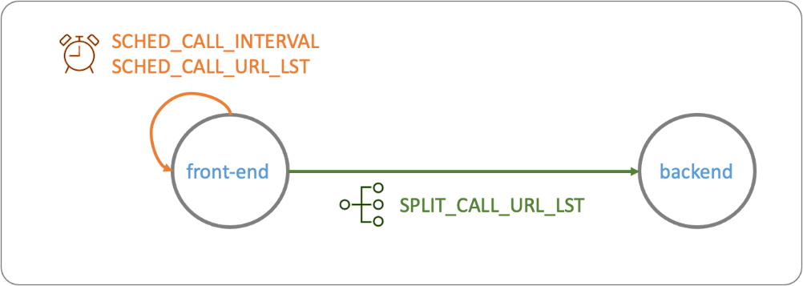

# Generic Service

```bash
uvicorn main:app --reload
```

## Build

```bash
docker build -t kdop/generic-service:0.0.5 .
```

## Push to docker hub

```bash
docker push kdop/generic-service:0.0.5
```

## Run

simple-app



```bash
# Create net
docker network create my-net

# backend
docker run -d --rm \
--hostname backend \
--network my-net \
--name backend \
kdop/generic-service:0.0.5

docker run --rm \
--hostname backend \
--network my-net \
--name backend \
kdop/generic-service:0.0.5

# front-end
docker run -d --rm \
    --network my-net \
    --hostname front-end \
    --name front-end \
    -e SCHED_CALL_URL_LST=http://front-end:8000/s \
    -e SCHED_CALL_INTERVAL=10 \
    -e SPLIT_CALL_URL_LST=http://backend:8000 \
    kdop/generic-service:0.0.5
```

Simulate error

```bash
docker run --rm \
--hostname backend \
--network my-net \
--name backend \
-e SCHED_CALL_URL_LST="http://backend:8000/r?code=504&wait=5" \
-e SCHED_CALL_INTERVAL=5 \
kdop/generic-service:0.0.5
```

## Logs

```bash
# Terminal 1
docker logs -f backend

# Terminal 2
docker logs -f front-end
```

## Clean-up

```bash
docker kill front-end backend
docker network rm my-net
```

## TODO

- [x] Add response date, app and version to body

Example:

```json
{
    "name": "message_type",
    "description": "any description or value",
    "app": "app-name",
    "version": "version-string",
    "when": "%Y-%m-%d %H:%M:%S"
}
```

- [x] Configurable delay. <uri>/r?code=<value>&wait=<value>. Example: http://localhost:8000/r?code=504&wait=10. Return status 504 after 10 seconds.
- [ ] Configurable response payload size - field data

Example:

```json
{
    "name": "message_type",
    "description": "any description or value",
    "app": "app-name",
    "version": "version-string",
    "when": "%Y-%m-%d %H:%M:%S",
    "data": "long string with parametrized size"
}
```

- [x] Configurable response code - Add endpoint that allow to change the behavior (response code) of the service. Tag 0.0.3
- [ ] Configurable method
- [ ] Configurable sync / assync request
- [ ] Simulation of micro front-end. `/` - web, `/api` - programming interface
- [ ] Check other alternatives like [Hey](https://github.com/rakyll/hey)
